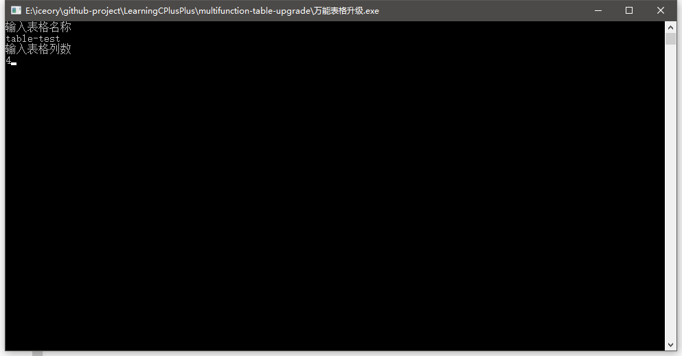
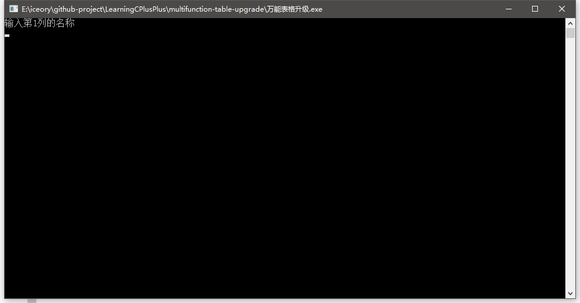

GitHub地址：https://github.com/ICEORY/Learning-C-Plus-Plus/tree/master/multifunction-table-upgrade

## 功能说明

1. 输入表格名称以及表格的列数和列的名称
2. 定义各个列的数据类型
3. 完成之后可以实现对数据筛选、排序(包括正序和倒序)
4. 退出
<!-- more -->
## 效果图

