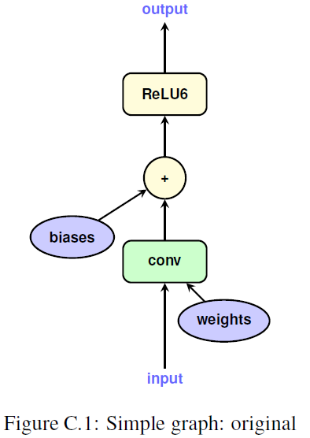
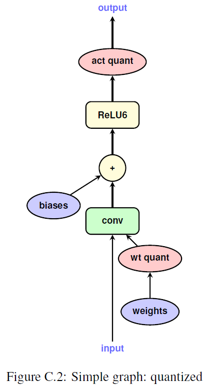
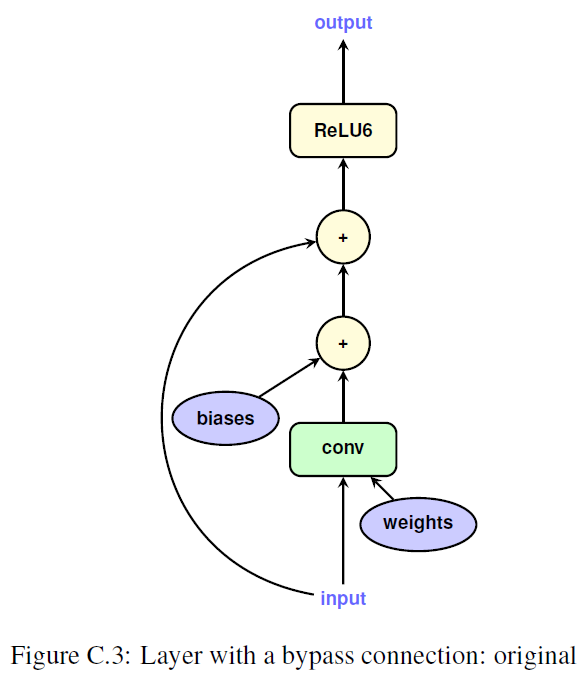
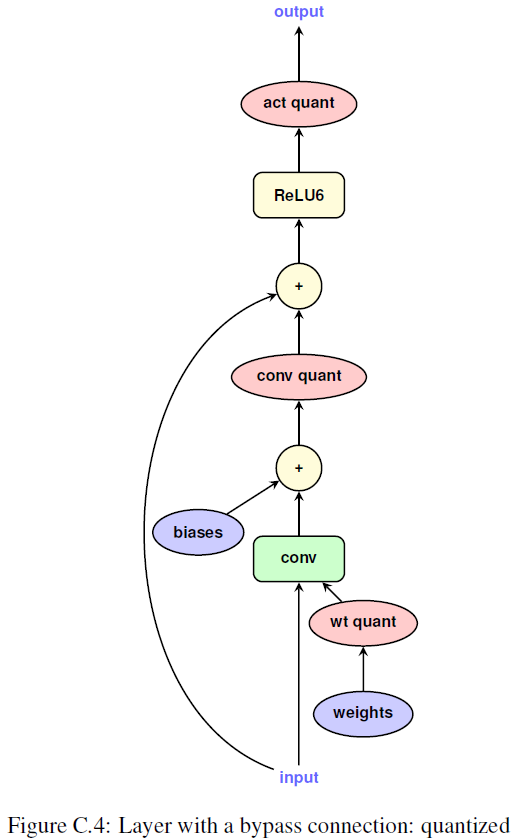
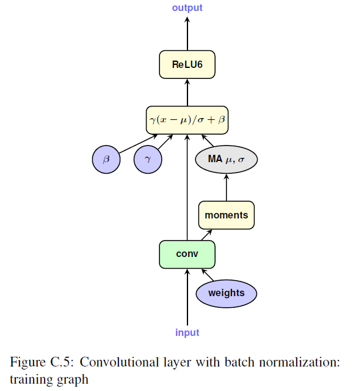
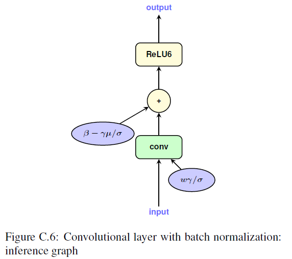
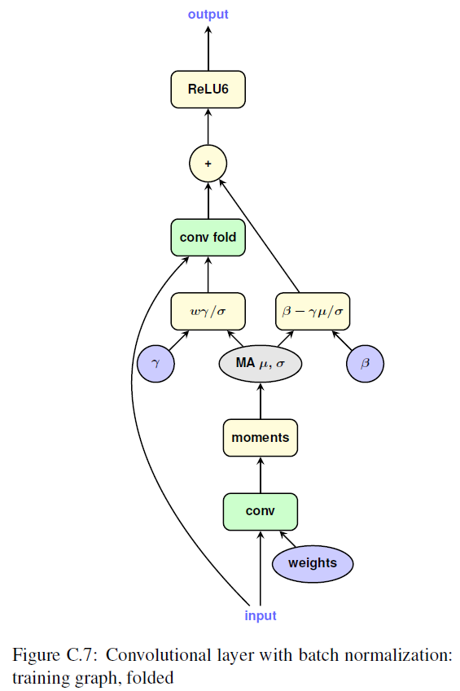
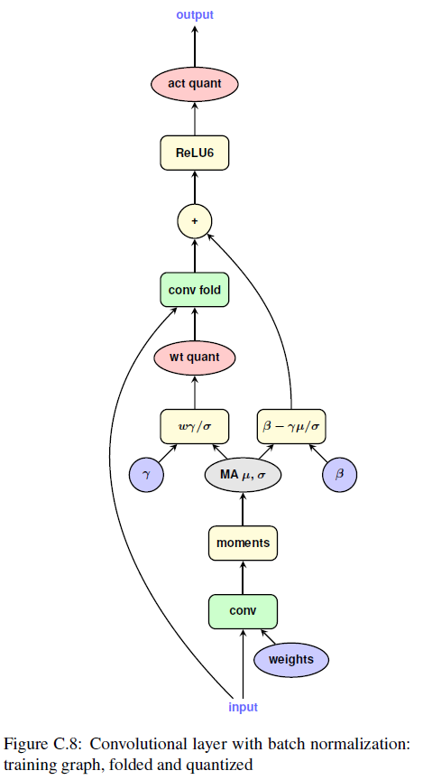

**Paper**: https://arxiv.org/abs/1712.05877

**Code**: refer to TensorFlowLite.quantize

## Training with simulated quantization

### Point-wise quantization:

$$
clamp(r;a,b) := min(max(r, a), b)
$$

$$
s(a,b,n) := \frac{b-a}{n-1}
$$

$$
q(r;a,b,n):=\lfloor \frac{clamp(r;a,b)-a}{s(a,b,n)} \rceil s(a,b,n)+a
$$
<!-- more -->
Here, $r$ represents the real value, $q$ represents the quantized value. $\lfloor \cdot \rceil$ denotes rounding to the nearest integer.

- for weights: $a:=min(w), b:=max(w)$

- for activation: collect [a;b] during training and aggregate them via exponential moving average (EMA)


```
exponential moving average (EMA) in tensorflow:

shallow_variable -= (1-decay) * (shallow_variable-variable)

reasonable values for decay are close to 1.0, e.g., 0.999, 0.99999, etc
```

**Note: activation quantization is disabled at the start of training** 

### compute gradient

$$ 
\frac{\partial{L}}{\partial{r}} = \frac{\partial{L}}{\partial{q}}\frac{\partial{q}}{\partial{r}}
$$

Here, we have $\frac{\partial{q}}{\partial{r}}=0$ if $r\notin[a,b]$, otherwise $\frac{\partial{q}}{\partial{r}}=1$.

## Inference with integer-arithmetic only

### Data type

- input: uint8

- weights: uint8

- bias: int32

- activation: int32

- output: uint8

### Affine mapping from q to r

Formulation:

$$ 
r = S(q-Z) \to q=\frac{r}{S}+Z
$$

where $S$ means "Scale" and $Z$ means "Zero point". And $S=s(a,b,n), Z=z(a,b,n)$.

Therefore, considering $r\_3=r\_1\*r\_2$:

$$
r\_3 = S\_3(q\_3-Z\_3), r\_1\*r\_2=S\_1S\_2(q\_1-Z\_1)(q\_2-Z\_2)
$$

$$
q\_3 = \frac{S\_1S\_2}{S\_3}(q\_1-Z\_1)(q\_2-Z\_2)+Z\_3
$$

Let $M:=\frac{S\_1S\_2}{S\_3}$ and $M=2^{-n}M\_0$, $M\_0\in(0.5,1]$.

For matrix multiplication of two matrices with size of $N\times N$.

$$
q\_3^{(i,k)} = Z\_3 +M\sum\_{j=1}^{N}(q\_1^{(i,j)}-Z\_1)(q\_2^{(j,k)}-Z\_2)
$$

It needs $O(N^3)$ subtraction to compute the result. 

More efficient implementation:

$$
q\_3^{(i,k)} = Z\_3 + M(\sum\_{j=1}^N q\_1^{(i,j)}q\_2^{(j,k)}-\sum\_{j=1}^N q\_1^{(i,j)}Z\_2-\sum\_{j=1}^N q\_2^{(j,k)}Z\_1 + \sum\_{j=1}^N Z\_1Z\_2)
$$

$$
q\_3^{(i,k)} = Z\_3 + M(\sum\_{j=1}^N q\_1^{(i,j)}q\_2^{(j,k)}-Z\_2 \bar a\_1^{(i)}- Z\_1a\_2^{(k)} + N Z\_1Z\_2),
$$

where $\bar a\_1^{(i)}:=\sum\_{j=1}^N q\_1^{(i,j)}$ and $a\_2^{(k)}:=\sum\_{j=1}^N q\_2^{(j,k)}$. Therefore, the computational costs is mainly from the computation of $\sum\_{j=1}^N q\_1^{(i,j)}q\_2^{(j,k)}$

### The Following operations

- scale down: int32 activation --> int8 output activation

- cast down: int8 activation --> uint8 output

### Batch normalization folding

$$
w\_{fold}:=\frac{\gamma w}{\sqrt{EMA(\sigma\_B^2)+\epsilon}}
$$

### Graph illustration

#### simple graph for single layer

- origin



- quantized



#### layer with bypass

- origin



- quantized



#### convolutional layer with batch normalization

- training



- inference



- training with fold



- training with fold quantized




