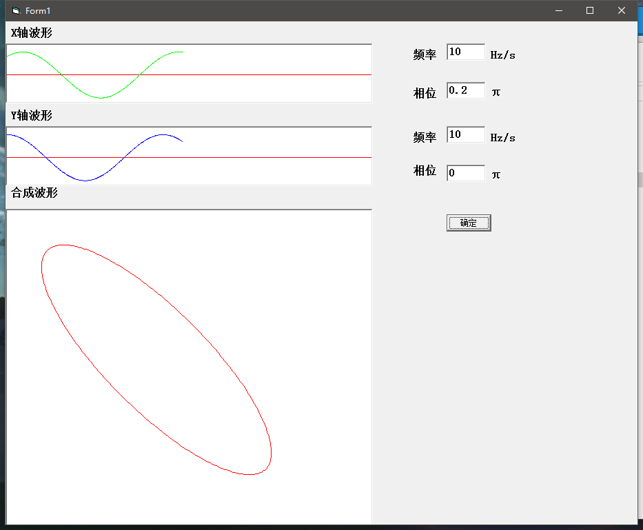
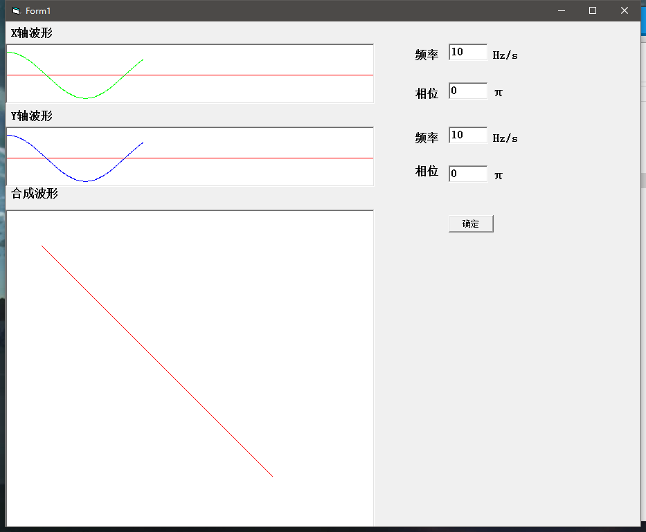
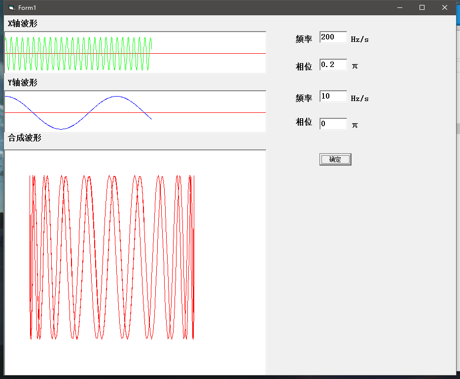

GitHub地址：https://github.com/ICEORY/LearningVB/tree/master/lissajous-figures

## 功能说明：

1. 绘制李萨如图形
<!-- more -->
## 结果展示

1. F1 = 10, P1 = 0.2pi, F2 = 10, P2 = 0pi

   

2. F1 = 10, P1 = 0pi, F2 = 10, P2 = 0pi

   

3. F1 = 200, P1 = 0.2pi, F2 = 10, P2 = 0pi

   
