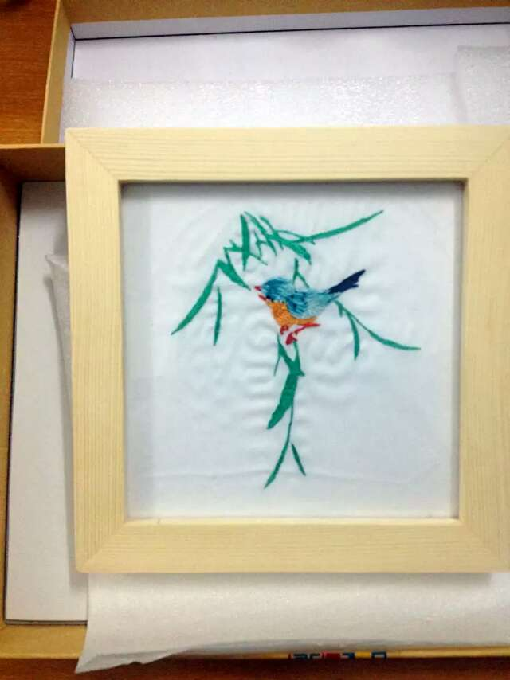

## 方向/兴趣

- 机器视觉

- 深度神经网络模型压缩

- 点云目标检测算法及嵌入式设备算法移植

## 教育经历

- 2016.09 - 2018.06 华南理工大学 软件学院   软件工程（创新班硕士阶段）
    * 研究深度神经网络的压缩和加速方法，以获取轻量级深度神经网络模型
    

- 2012.09 - 2016.06 华南理工大学 自动化学院 自动化创新班（本科阶段）
    * 学习自动控制理论、电子电路等课程，其中实验课/课程设计均为优秀 
    
## 校内经历

- 2016.09 - 2017.06 毽球社 组织部长
   
   * 组织围毽活动
   
   * 协助管理社团活动
  
- 2014.09 - 2015.06 自动化本科生课外创新实践基地 总负责人
   
   * 与其他负责人一起管理基地日常事务，包括技术培训、日常值班等

   * 与其他组织一起举办各类科技竞赛，并提供技术支持

<!-- ## 科研经历

- 模型压缩

    * 提出 Loss-aware Channel Pruning 对深度神经网络模型进行压缩，在 CIFAR-10/ImageNet 上算法性能超过现有剪枝方法，相关成果已整理成文，待投稿
    
    * 在 PyTorch上 复现多篇剪枝与量化相关的文章：
    
        * ThiNet: A Filter Level Pruning Method for Deep Neural Network Compression
    
        * Channel Pruning for Accelerating Very Deep Neural Networks
    
        * Ternary Weight Networks

- 车道线检测 
    
    * 复现 DeepLanes: End-To-End Lane Position Estimation Using Deep Neural Networks：构建仿真数据集，搭建 CNN 模型，实现车道线位置像素级检测。Top-1/Top-5 准确率 89.01%/99.61%

- 人脸识别
    
    * 对 SphereNet-4 进行压缩，LFW 十折交叉验证准确率 98.30%，模型参数/MAdds：5.89M/45.15M (原模型：12.56M/164.61M，准确率 98.20%)  
    
    * 复现 Learning A Metric Embedding for Face Recognition Using the Multibatch Method：构建 VGGFace 数据集，在 Caffe 上自定义 MultibatchLoss 层，并对模型进行训练

- 训练方法优化 

    * 复现 AuxNet：基于PyTorch实现，通过多个 Auxiliary losses 提升模型的性能

    * 提出贪婪算法逐渐增加ResNet深度，并不断迭代地训练，从而提升模型的性能 -->

## 工作经历

- 2018.06-2020.08 深圳市速腾聚创科技有限公司 **算法工程师** 

    * 算法方面主要负责深度学习模型的压缩和部署，具体包括：基于点云的目标检测算法改进，提升算法性能；负责深度学习模型的压缩以及算法在不同硬件平台上的移植，并评估硬件平台的性能
    * 工程方面主要负责组内工具链的搭建，具体包括：分布式深度学习训练平台的搭建和维护；负责深度学习训练框架的搭建和维护；负责高效办公的工具链探索和部署，包括网页版点云打标工具设计、网页版数据管理平台设计、项目管理平台部署、文档管理平台部署等
  
- 2015.06 - 2015.08 广州·中国科学技术研究院先进技术研究所 **实习生** 

    * 在实习单位所研发的仿生眼监控系统的基础上，使用深度学习算法对视频中的行人、车辆进行识别。算法使用的模型基于 GoogLeNet 进行修改，在 Caffe 平台上进行算法实现，利用监控系统收集的样本进行训练和测试。成果发表于 **EME2015**，详见：http://ir.siat.ac.cn:8080/handle/172644/7568

## 工程经历

- **带反馈的脑机接口系统及脑信号处理** 

    * 中央高校基础科研项目，主要研究基于触觉的脑机接口系统。通过感受贴于手臂上的电极刺激，触发特征脑电信号，从而实现对显示屏中小球方向的控制。平台基于 MFC，算法基于 Matlab 实现。主要负责平台实现，包括：控制电刺激设备、采集脑电信号、调用 Matlab 算法

- **基于 CPLD 的五层楼电梯模拟平台**

    * 基于 CPLD 设计一个五层楼的电梯仿真平台，实现对楼层的显示、每个楼层到达次数的计数、面板按键显示、通风灯光设备运行模拟、电梯门防夹功能模拟、步进电机控制（电梯运行模拟）。负责算法设计、硬件实现（包括电路图设计、布线、制板、焊接），详见：https://github.com/ICEORY/ElevatorCPLD

## 专业技能

- 英语技能：CET-4 & CET-6

- 编程语言：擅长 Python, 熟悉 Matlab, 有 C、C++、Java、VB 使用经历

- 深度学习：熟悉 PyTorch 平台，有 Caffe 项目经历，具备硬件设计基础

- 硬件设计：熟悉 51 单片机设计，有 CPLD 设计经验；有 Altium Designer、 Solidworks 设计经验；

- 硬件移植平台： FPGA Zync系列、Nvidia 嵌入式GPU（TX2\Xavier等）、ARM (A72/A530)及支持AI引擎的设备如HORIZON、CAMBRICON等

## 兴趣爱好

- 踢毽子

- 听音乐

- 手工制作

## 个人荣誉

### 学术类

- 2019.10   公开发明专利“道路盲区监控方法、系统、装置、设备和存储介质”
  
- 2019.08   公开发明专利“激光雷达保护装置”

- 2019.07   公开发明专利“激光雷达检测设备、检测方法和控制系统”

- 2019.07   公开发明专利“传感器稳定性的提升方法、系统、装置、设备和存储介质”
  
- 2018.12   "Discrimination-aware Channel Pruning for Deep Neural Networks" 发表于 **NeurIPS2018**

- 2017.09   2016-2017学年度研究生二等奖学金

- 2017.08   实用新型专利“一种基于色带的可谱曲电子音乐装置”授权

- 2017.08   实用新型专利“一种积木式编程的教育机器人”授权

- 2015.09	"Application of Deep Learning in Bionic Eye Monitoring System" 发表于 **EME2015**

- 2015.05	中央高校基础科研项目《带反馈的脑机接口系统及脑信号处理》结题

- 2014.12	2013-2014 学年度二等奖学金

- 2013.10	2012-2013 学年度一等奖学金

### 竞赛类

- 2016.05 	华为 CodeCraft 港粤澳赛区三等奖

- 2015.09	“海峡两岸”爬行与行走机器人会议机器人竞赛一等奖

- 2015.08	全国大学生电子设计竞赛华南赛区三等奖

- 2015.06	“泰和安杯”消防电子设计竞赛一等奖

- 2015.05	全国大学生电子设计竞赛校内选拔赛三等奖

- 2014.10	华南理工大学自动化第十三届学生运动会毽子比赛第七名

- 2013.12	华南理工大学第五届电梯创意设计优胜奖

- 2013.11 	第十三届机械结构设计大赛一等奖

- 2013.09   中山大学第六届智能车挑战赛优胜奖

- 2013.05   华南理工大学第八届智能控制设计大赛初级组一等奖

- 2012.03   第五届巡线小车比赛三等奖 

- 2012.12	“蒂森克虏伯杯”华南理工大学电梯设计大赛创意组三等奖   

- 2012.12   2012 “炬力集成”无线杯电子设计大赛二等奖       

### 行政类

- 2019.11   深圳市速腾聚创科技有限公司年度绩效S级（最高级）

- 2019.03   深圳市速腾聚创科技有限公司年度优秀个人“明日之星“奖

- 2016.05	第十六届广东省青少年机器人竞赛优秀裁判员

- 2016.05 	第十六届广东省青少年机器人竞赛FLL项目裁判员

- 2015.05	第十五届广东省青少年机器人竞赛FLL工程挑战赛裁判

- 2014.10	2014 年华南理工大学“暑假社会实践先进个人”称号

- 2014.06	2013 年度优秀共青团员

- 2014.05	第十四届广东省青少年机器人竞赛优秀裁判员

- 2014.05	第十四届广东省青少年机器人竞赛FLL工程挑战赛裁判

- 2014.01 	2012-2013 学年优秀学生干部

- 2014.01	2012-2013 学年度三好学生

- 2013.12	华南理工大学“暑假社会实践先进个人”称号

- 2012.09   2012 级军训先进个人

<!-- ## 业余作品

### 文艺类

- 十字绣

- 缎带花束

- 苏绣

### 设计类

- 塔

- 室内平面设计

- 摩天轮

### 电子类

- 单片机下载器

- 五层楼电梯

- 发光毽子

- 摆杆

- 摇摇棒

- 旋转时钟

- 无线计数器

- 烟雾报警器

- 温湿度控制系统

 -->

